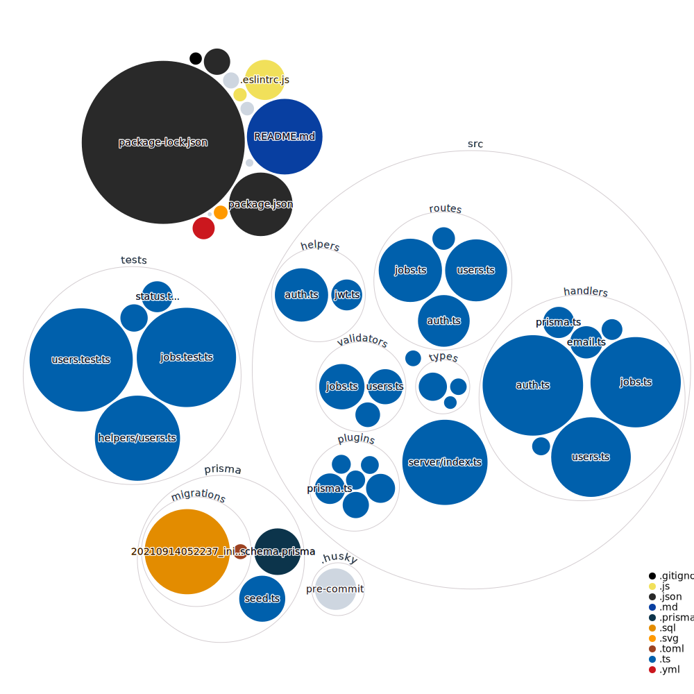

# Skills CLI back-end

Hey there! This is the v1 of an experimental service.

What if Linkedin existed as a CLI? Well, this is the back-end of such a project.
This application stores data related to users.

Users have jobs and each job contains, skills, descriptions and title.

## Local Development

This is just a typescript project.

Please use at least Node v14, but the recommended version is Node v16.50. There's a `.nvmrc`, you can run `nvm use` if you have nvm installed.

## Dependency Diagram



## Getting Started

This project heavily favors <b>npm</b> over yarn.

So to set things up you need to run:

```bash
npm install
```

Then to build the application and generate the schema:

```bash
npm run build
```

create an .env file:

```bash
touch .env
```

Create a JWT secret:

```bash
node -e "console.log(require('crypto').randomBytes(256).toString('base64'));"
```

Add the following lines in the .env file:

```.env
SENDGRID_API_KEY=
JWT_SECRET=secret-you-generated-at-the-previous-step
```

Then to run the development server:

```bash
npm run dev
```

## API access

The access to the api is protected by Okta.
You ll need to get a bearer token and add it to your headers when making a request.

## Deployment

TBD

## Credits

Made with Love and :coffee:

Yann
