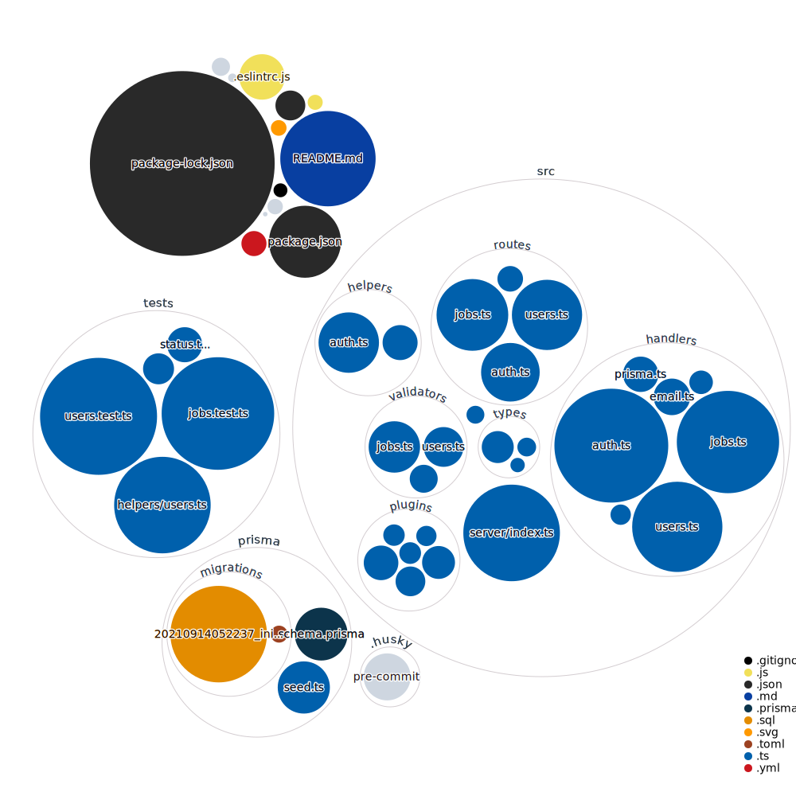

# Skills CLI back-end

Hey there! This is a v1 of my personal website.

What is Linkedin existed a s a CLI? Well, this is the back-end of such a project.
This application stores data related to users.

Users have jobs and each jobs contains, skills, descriptions and title.
By using this API you can save a new user, add jobs, skills, and finally search for a user with a specific skill.

## Local Development

This is just a typescript project.

Please use at least Node v14, but the recommended version is Node v16.50. There's a `.nvmrc`, you can run `nvm use` if you have nvm installed.

## Dependency Diagram



## Getting Started

This project heavily favors <b>npm</b> over yarn.

So to set things up you need to run:

```bash
npm install
```

Then to run the development server:

```bash
npm run dev
```

## API access

The access to the api is protected by Okta.
You ll need to get a bearer token and add it to your headers when making a request.

## Deployment

TBD
## Credits

The avatars are made by [getavataaars](https://getavataaars.com/).

Made with Love and :coffee:

Yann
